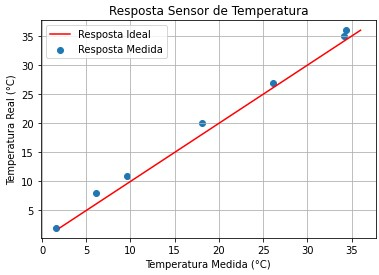

# Sonda

## Índice
* [Introdução](#introdução)
* [Arquitetura](#arquetura)
* [Sensores](#sensores)
	* [Temperatura](#temperatura)
	* [pH](#ph)
	* [Turbidez](#turbidez)
	* [TDS](#tds)
* [Protótipo](#prototipo)

---

## Introdução

A água é o elemento essencial para a vida. Logo, mensurar sua qualidade é fundamental nas mais diversas áreas: políticas públicas, conservação ambiental,
agropecuária, tratamento de resíduos ambientais. 

Análises de laboratório são muito precisas, porém tem um custo considerável, 
é necessário ter uma equipe para coletar corretamente as amostras e, por fim, o tempo até se ter um resultado. Como pontuado por [Helmi et al., 2014](https://ieeexplore.ieee.org/document/7086223), 
em um reservatório de água de grande porte são necessárias análises de vários pontos para ser real noção 
da qualidade da água. Já [Xu et al., 2011](https://www.sciencedirect.com/science/article/abs/pii/S0025326X11004036) ressalta a importância de dados de qualidade de 
água em longa duração, isto é, a medição periódica por vários anos. 

Nesse contexto, uma sonda multiparametros de operação remota é uma solução aplicável. Não necessita de coletas, consegue gerar um grande volume de dados por um longo tempo e tem apenas um custo inicial.

---

## Arquitetura

O projeto tem como base a placa [TTGO-T-Beam](https://github.com/LilyGO/TTGO-T-Beam), um kit de desenvolvimento 
[ESP32](https://docs.espressif.com/projects/esp-idf/en/latest/esp32/get-started/index.html) que já conta com GPS e LoRa. 
Sensores de temperatura, pH, TDS e turbidez fazem a aquisição dos dados, além do GPS. O armazenamento se dá através de um módulo de cartão SD. 
A transmissão dos dados se dá através de LoRa. O controle desses módulos é feito através do [FreeRTOS](https://www.freertos.org).
A alimentação é feita por uma placa solar com um regulador stepdown.

A arquitetura do projeto pode ser vista abaixo:


---

## Sensores

A sonda possui sensores de [temperatura](temperatura), [pH](ph), [turbidez](turbidez) e [TDS](tds). Todos eles são de baixo custo e analógicos.

### Temperatura

Segundo a [Enciclopédia Britannica](https://www.britannica.com/science/temperature), temperatura é uma medida de calor ou frio, 
que é expressa dentro uma escala arbitrária, e indica a direção do fluxo espontâneo de energia térmica. Isto é, de um corpo mais quente 
(com maior temperatura), para um corpo mais frio (com menor temperatura).
É um parâmetro com uma grande importância biológica. Alterações abruptas, ou que ultrapassem um intervalo ótimo, podem gerar mortandade de espécies. Por exemplo, 
[Niswar et al., 2018](https://ieeexplore.ieee.org/document/8600828) trata de um ambiente de produção de caranguejos (*Portunus Pelagicus* e *Scylla serrata*)
e mostra que fora de um intervalo certo suas larvas não se desenvolvem.

#### Termistores

Como sensor de temperatura, utiliza-se o termistor [MF-58](https://cdn.awsli.com.br/945/945993/arquivos/Datasheet%20MF58.pdf). Que é do tipo NTC e possui resistência interna de 10k ohms. 
Segundo [Morris e Langari (220 pg. 364)](https://www.worldcat.org/pt/title/1196195913), termistores são pequenos semicondutores feitos de óxidos de metais ferrosos como crômio, cobalto, ferro, manganês e níquel.


Sua resistência varia conforme a temperatura do meio. Caso a resistência diminua com o aumento da temperatura, possui um **C**oeficiente de **T**emperatura **N**egativo e é do tipo **NTC**. Caso contrário, possui um **C**oeficiente de **T**emperatura **P**ositivo e é do tipo **PTC**. Tendo um baixo custo e alta disponibilidade em diferentes encapsulamentos torna-se ideal para utilização neste projeto. 

Porém, trata-se de um sensor não-linear, o que implica na necessidade da utilização de uma equação mais complexa para se extrair, de fato, o valor de temperatura a partir da resistência do componente. Além de uma calibração que é feita para ajustar a saída dessa resposta não-linear.

#### Equação de Steinhart

A temperatura de termistores NTC, que é o utilizado no projeto, é comumente computada através da equação de [Steinhart & Hart, 1968](https://www.sciencedirect.com/science/article/abs/pii/0011747168900570?via%3Dihub), que é dada por:

$$\begin{equation}
	\frac{1}{T} =  A + B\ln{R} + C(\ln{R})^3
\end{equation}$$

Onde $T$ é a temperatura em Kelvin, $R$ é a resistência e $A$, $B$ e $C$ são constantes. Uma das formas mais comuns de tratar essa equação é simplificá-la para a equação de parâmetro $\beta$, como feito por [Petkovšek et. al, 2021](https://www.mdpi.com/2227-7390/9/18/2266):

$$\begin{equation}
	R = R_0e^{\beta(\frac{1}{T}-\frac{1}{T_0})}
\end{equation}$$

Onde $R_0$ é a resistência do termistor a uma temperatura $T_0$, que no caso vale 298.15K, ou 25°C. O valor de $T_0$ é dada pelo datasheet do componente.

Em sequência, utiliza-se as seguintes substituições para $A$, $B$ e $C$:

$$\begin{equation}
	A = \frac{1}{T_0} - \frac{1}{\beta}\ln{R_0}
\end{equation}$$

$$\begin{equation}
	B = \frac{1}{\beta}
\end{equation}$$

$$\begin{equation}
	C = 0
\end{equation}$$

Resultando em:

$$\begin{equation}
	\frac{1}{T} =  \frac{1}{T_0} - \frac{1}{\beta}\ln{R_0} + (\frac{1}{\beta})\ln{R}
\end{equation}$$

$$\begin{equation}
	\frac{1}{T} =  \frac{1}{T_0} + \frac{1}{\beta} \ln{\frac{R}{R_0}}
\end{equation}$$

#### Cálculo de $R$

Visto que $T_0$, $\beta$ e $R_0$ são constantes, basta possuir o valor de $R$ para encontrar-se $T$. Isto é feito colocando um resistor de valor conhecido em série
com o termistor. Em seguida, mede-se a tensão entre os componentes e chega-se ao valor atual de $R$:


Onde $R_c$ é o resistor conhecido e $V_m$ é a tensão medida pelo ADC do projeto.

Aplicando a lei de Ohm:

$$\begin{equation}
	V_{dd} = (R+R_c)i
\end{equation}
$$
$$
\begin{equation}
	V_{m} = R_ci
\end{equation}
$$

Onde $i$ é a corrente que atravessa o circuito. Com essas equações, chega-se a:

$$
\begin{equation}
	V_{dd} = \frac{RV_m}{R_c}+V_m
\end{equation}
$$

$$
\begin{equation}
	\frac{RV_m}{R_c} = V_{dd}-V_m
\end{equation}
$$


$$
\begin{equation}
	R = (\frac{V_{dd}}{V_m}-1)R_c
\end{equation}
$$

Com isso, dado uma tensão $V_m$, chega-se a uma resistência $R$ e consequentemente, a temperatura $T$.

#### Cálculo de temperatura

Como esse valor de tensão é analógico, ele deve ser previamente convertido para um valor discreto, o que é feito pelo ADC (Analogical to Digital Converter) do sistema.
Isto posto, o valor de $V_{dd}$ é considerado o maior valor que o ADC pode assumir, ou sua resolução. Se o ADC possui 10 bits de resolução, o maior valor é de $2^{10} = 1024$, por exemplo.
Com essa conversão é possível calcular a temperatura através em um código da seguinte forma:
```c
	float calculate_temp(int adc_read){
		float R = ((ADC_MAX/adc_read)-1)*Rc;
		float temp = 1/T0 + (1/BETA_VALUE)*log(R/R0);
		temp = 1/temp;
		return temp;
	}
```

#### Calibração

Esse cálculo de temperatura retorna um valor próximo da temperatura, porém é necessário fazer uma calibração que segue o processo de [Earl, 2022](https://cdn-learn.adafruit.com/downloads/pdf/calibrating-sensors.pdf):

1. Recolher amostras de temperatura com um termômetro aferido e com o projeto:
	
	
	
2. Realizar o ajuste de curvas, nesse caso feito por uma regressão linear:

	
	
3. Realizar a calibração de um ponto. Ajustando o offset da reta da regressão linear, para que ela se sobreponha a resposta ideal, do termometro aferido:

	
	
4. Recuperar a equação da reta calibrada e aplicar na função de cálculo da temperatura:

$$ \begin{equation}
	y(x) = ax + b
\end{equation}$$

Onde $x$ é a temperatura calculada por ```calculate_temp``` e $y$ é a temperatura real da água. $a$ e $b$ são os coeficientes da reta calibrada:

```c
	float calculate_temp_calibrated(float adc_read){
		float x = calculate_temp(adc_read);
		return x*a + b;
	}

```
Os cálculos e gráficos da calibração foram feitas em [python](https://colab.research.google.com/drive/1osgXfeNHnKusb40EnVSFQ25BPt1Z2Xhu?usp=sharing) utilizando as bibliotecas sklearn e matplotlib.


### pH

Sørensen descreveu pela primeira vez o pH como a concentração de íons de hidrogênio. [Atualmente](https://www.degruyter.com/document/doi/10.1351/pac200274112169/html), 
é entendido pelo cologaritmo da atividade dos íons de hidrogênio. 
Sendo dado pela relação: $pH = -\log{a_H}$, onde $a_H$ é a atividade dos íons em $\frac{mol}{dm^3}$.
O pH consegue descrever o quanto uma solução é ácida ou básica. Sua escala, que é logaritimica, vai de 0, extremamente ácida, até 14, extremamente básica. 

É um fator muito relevante em análises de qualidade de água, pois alterações na acidez sugerem que fenômenos importantes estão acontecendo. 
A [acidificação oceânica](https://books.google.com.br/books?id=eoxpAgAAQBAJ&hl=pt-BR), por exemplo, é um fenômeno potencializado pelas mudanças climáticas
que prejudica diversos organismos e fotossíntese, e é mensurado através da escala de pH ao longo do tempo. Em reservatórios é uma grandeza que pode sugerir algum 
processo de [eutrofização](https://sciencing.com/eutrophication-affect-ph-12036599.html), que pode ser resultado de poluição por esgotos ou fertilizantes.

Como sensor de Ph utiza-se, um [sensor](https://www.usinainfo.com.br/index.php?controller=attachment&id_attachment=553) analógico de baixo custo, 
comumente utilizado em aquários.


Este tipo de sensor funciona medindo a diferença de tensão entre dois 
eletrodos, um de referência e outro sensor. Ambos estão isolados em tubos 
de vidro poroso para íons de hidrogênio. 
O eletrodo de referência fica imerso em uma solução de pH neutro. Enquanto 
o eletrodo sensor fica imerso em uma solução saturada de cloreto de 
potássio. O conjunto é mergulhado na solução a ser medida. Conforme os 
íons de hidrogênio se acumulam no vidro e substituem os íons metálicos do 
tubo, há a formação de uma corrente elétrica, que é capturada pelos 
eletrodos e a diferença entre as tensões é convertida em pH, pelo pHmetro.

Um exemplo desse tipo de montagem é mostrado a seguir:


### Turbidez

A aparência nebulosa da água devido a suspensão de partículas finas é denominada 
[turbidez](https://onlinelibrary.wiley.com/doi/epdf/10.1111/j.1752-1688.2001.tb03624.x). Quanto maior a quantidade de partículas em suspensão, mais turva
é a água. Possui uma importância biológica grande, uma água que se torna turva repentinamente pode indicar a presença de poluição, por exemplo. As partículas 
podem prejudicar as brânquias dos peixes e diminuir a incidência de luz no ambiente sub aquático.

Como sensor, utiliza-se um módulo analógico de baixo custo, [TS-300B](http://images.100y.com.tw/pdf_file/46-TS-300B.pdf). Comumente utilizado
em máquinas de lavar roupa ou lavar pratos. Com a função de fazer uma 
medição da turbidez da água, antes e depois das lavagens, para saber se é 
necessário mais um ciclo de limpeza.


Esse tipo de sensor funciona com a emissão de uma luz entre dois pontos 
através da água. Ou seja, um ponto emite luz e o outro a percebe. 
Quanto mais clara estiver a água, maior a penetração da luz, e por sua vez,
maior a quantidade de luz percebida pelo sensor. Da mesma forma, quanto
mais turva a água, menor é a quantidade percebida pelo sensor.


### TDS

TDS é o acrônimo em inglês para Total Dissolved Solid, ou sólidos 
dissolvidos totais. Pode ser descrito como [a medida de sais inorgânicos, matéria orgânica e outros materiais dissolvidos na água](https://citeseerx.ist.psu.edu/viewdoc/download;jsessionid=C9AC49848D8E364703B4E4C7957C5399?doi=10.1.1.483.218&rep=rep1&type=pdf).
Essa grandeza está intimamente relacionada com a condutividade elétricada água, como explicado por [Rusydi, 2018](https://iopscience.iop.org/article/10.1088/1755-1315/118/1/012019/pdf).

Se tratando de água potável, um valor alto de TDS implica em um [sabor ruim](https://doi.org/10.1016/j.desal.2018.04.017). 
No ambiente, o aumento dessa escala implica em um aumento de salinidade, que pode levar a mortandade de espécies. Também já foi descrita por [Bierhuizen e Prepas, 1985](https://cdnsciencepub.com/doi/10.1139/f85-199) uma 
correlação negativa significante entre a presença de íons $Na^+, Mg^{2+}, SO_4^{2-}, HCO_3^-$ e $CO_3^{2-}$ e a produção de clorofila tipo a.

As unidades para TDS são $mg/L$ ou $ppm$, que são equivalentes, considerando a densidade da água $\rho = 1\frac{kg}{L}$ pela análise dimensional:

$$ \begin{equation}
	1\frac{mg}{L} = 1\frac{mg}{L\rho} = 1\frac{g10^{-3}}{g10^3} = 1\frac{1}{10^{6}} = 1ppm
\end{equation}$$

Diferente da turbidez, que mede os sólidos em suspensão, o TDS mede os 
sólidos dissolvidos. Na prática, as moléculas desses sólidos se quebram em 
íons. Esses íons aumentam a condutividade elétrica da água. E os sensores
medem justamente essa condutividade, quanto mais condutiva, mais íons e 
mais sólidos dissolvidos. O principal componente desses sólidos, são sais, que possuem ligações iônicas, e por isso é intimamente ligado ao nível de salinadade do sistema.

A resolução [CONAMA N° 357, DE 17 DE MARÇO DE 2005](https://www.icmbio.gov.br/cepsul/images/stories/legislacao/Resolucao/2005/res_conama_357_2005_classificacao_corpos_agua_rtfcda_altrd_res_393_2007_397_2008_410_2009_430_2011.pdf) classifica os tipos de água de acordo com a salinidade da seguinte forma:

| Tipo de água | Salinidade (s ppm) |
|--------------|------------------|
| Doce         | s ≤ 500             |
| Salobra      | 500 ≤ s ≤ 3000     |
| Salgada      | s > 3000            |


O sensor utilizado no projeto é o [keyestudio TDS Meter v1.0](https://wiki.keyestudio.com/KS0429_keyestudio_TDS_Meter_V1.0). Ele consegue medir até a escala de 1000 ppm, ou seja, o projeto consegue operar em água doce e parcialmente em água salobra. Caso a salinadade esteja fora da escala do sensor, sua medida não será confiável. Sendo possível apenas distinguir se a água é doce ou salobra até 1000 ppm. 


---

## Protótipo

No momento o projeto é um protótipo capaz de registrar a temperatura em um cartão sd, em um arquivo .csv, e transmitir mensagens via LoRa. Novos sensores, 
a comunicação GPS será estabelecida e questões de alimentação são pontos a serem adicionados e resolvidos em breve.
Uma foto do hardware atual do projeto pode ser vista a seguir:


O [placa com display](https://heltec.org/project/wifi-lora-32/) se trata do cliente LoRa, e recebe as mensagens enviadas pelo projeto.

## Esquemático


